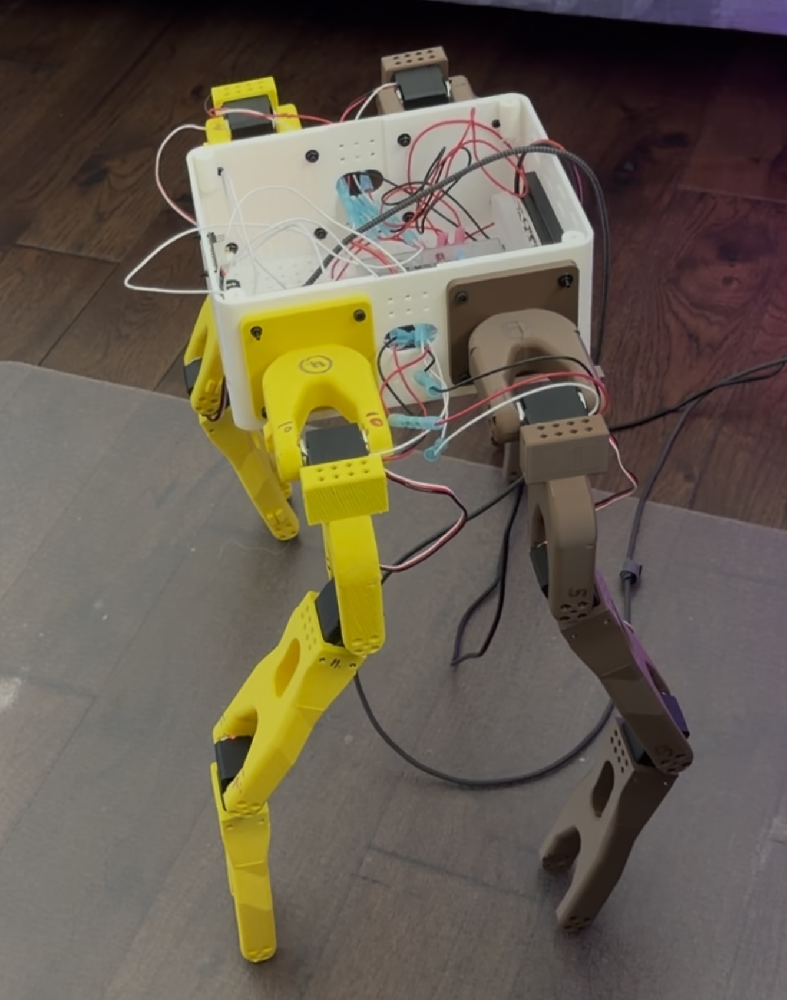

# drobot2

Monorepo for the Drobot2 robot. Engineering areas are separated at the
repository root so CAD, simulation, hardware control, and electrical design
can evolve without sharing one package boundary.

## Project areas

- [`cad/`](cad/README.md) — parametric mechanical design,
  CAD-derived URDF generation, manufacturing exports, vendor geometry, and CAD
  review tooling.
- [`simulation/`](simulation/README.md) — Isaac Sim integration, reinforcement
  learning, trained policies, simulator exports, evaluation media, and
  simulation documentation.
- [`hardware/`](hardware/README.md) — one-leg commissioning and four-leg
  hardware control/test applications.
- [`onboard/`](onboard/README.md) — ROS 2 Raspberry Pi runtime, LAN browser
  control, ROS services/topics, and boot-service setup.
- [`electrical/`](electrical/README.md) — power distribution, fusing, wiring,
  schematics, BOM, and power-budget planning.

Run domain-specific commands from the repository root unless that area's
README says otherwise. Shared architecture and repository conventions are
indexed under [`docs/`](docs/README.md). Generated caches and local
environments remain ignored.
