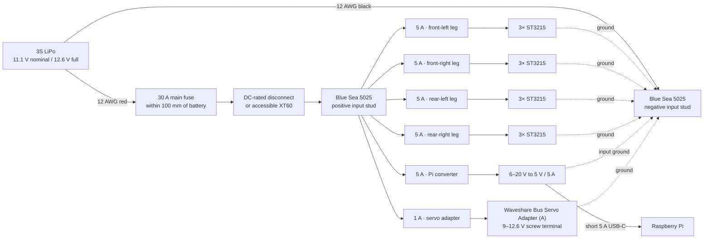
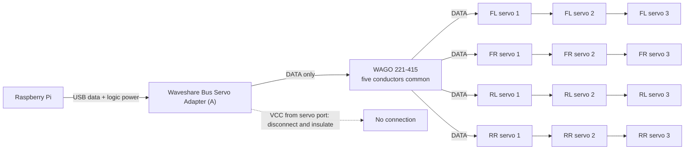

# Electrical schematics

These are low-voltage wiring diagrams for the proposed robot harness. They are
not a PCB schematic and have not yet been validated on the finished robot.

## Power distribution



Negative is a common return bus, not four isolated negative circuits. Never
place the 30 A fuse in the negative lead.

## Controller and servo data



The diagram shows the data conductor for clarity. Every servo-to-servo cable
also carries that leg's fused battery positive and common ground. Give all
twelve servos unique IDs before joining the legs.

The WAGO is a passive junction, not an active repeater. Keep the four data
stubs short and route each with a nearby ground conductor. Validate packet
errors at the selected baud rate.

## One body-to-leg pigtail

```text
Blue Sea 5025 branch screw, through 5 A fuse
    |
    +---- red 22 AWG --------------------------+
                                                   Mini-SPOX to servo 1
WAGO 221-415 DATA port                              pin 1  DATA
    |                                              pin 2  VCC
    +---- white 22/24 AWG ---------------------+   pin 3  GND
                                               |
Blue Sea 5025 negative-bus branch screw        |
    |                                          |
    +---- black 22 AWG ------------------------+
```

The official Waveshare serial-bus schematic assigns:

| Mini-SPOX position | Function | Conventional cable color |
| ---: | --- | --- |
| 1 | `DATA` | White |
| 2 | `VCC` | Red |
| 3 | `GND` | Black |

Treat the color column as a convenience, not proof. Connector end orientation
can reverse what appears visually left-to-right. Confirm the numbered
positions and electrical continuity before applying power.

## Adapter breakout

Use one premade Waveshare 5264-3PIN cable:

```text
adapter servo port pin 1 DATA  ----> WAGO 221-415
adapter servo port pin 2 VCC   ----> cut short, individually insulated
adapter servo port pin 3 GND   ----> common negative bus
```

Separately connect:

```text
5025 circuit 6, 1 A fused positive ----> adapter green terminal +
5025 negative bus --------------------> adapter green terminal -
Raspberry Pi USB host ----------------> adapter USB-C data port
```

Do not connect the adapter servo-port `VCC` to the four leg-positive branches.
That would bypass the branch isolation and create parallel power paths.

## Raspberry Pi branch

```text
5025 circuit 5, 5 A fused positive ---> converter DC input +
5025 negative bus --------------------> converter DC input -
converter USB-C output --------------> Raspberry Pi power USB-C
Raspberry Pi USB-A ------------------> servo adapter USB-C data
```

Measure the converter output and polarity before plugging in the Pi. Use a
short 5 A-rated USB-C cable and ventilate the converter.

## Continuity checks with the battery removed

Before first power:

| Test | Expected result |
| --- | --- |
| Battery-side `+` to battery-side `-` | No short |
| Every leg red wire to only its fuse output | Continuity |
| Every leg black wire to negative bus | Continuity |
| All four leg white wires to adapter `DATA` | Continuity |
| Any leg red wire to adapter servo-port `VCC` | No continuity |
| Any leg red wire to another leg red wire with fuses removed | No continuity |
| Pi converter input `+` to circuit 5 | Continuity |
| Adapter terminal `+` to circuit 6 | Continuity |
| Positive conductor to robot frame/fasteners | No continuity |

Then install only the 1 A adapter fuse and power the system from a
current-limited bench supply. Add one branch fuse at a time before using the
high-C battery.
