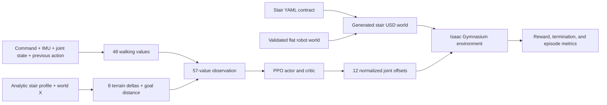

# Stair policy architecture

## Design boundary

The stair policy is a new PPO model, not an extra mode inside the flat policy.
This separation prevents a 57-input stair checkpoint from being mistaken for
the existing 48-input walking checkpoint and keeps experimental reward,
curriculum, and terrain assumptions out of the validated flat task.



The editable source of truth is
[`quadruped_stairs_v1.yaml`](../../simulation/isaac/rl/stairs/quadruped_stairs_v1.yaml)
plus the Python contracts in `simulation/isaac/rl/stairs/`. The generated USD
world, checkpoints, reports, TensorBoard events, screenshots, and recordings
are outputs, not configuration sources.

The YAML explicitly lists both files on which the composed world depends:

- `exports/isaac/quadruped_robot_manual_world.usda`;
- `exports/isaac/quadruped_robot_floating.usdc`.

Their individual hashes travel with the world report and every model manifest.
Hashing only the small top-level stair USDA would miss a robot or physics
change inside a referenced layer.

## World geometry

The stair generator creates four stacked collision layers. Extending every
lower layer through the upper treads avoids cracks or unsupported vertical
gaps between separate boxes.

| Surface | World X interval | Surface Z |
| --- | ---: | ---: |
| Flat approach | below `0.55 m` | `0.00 m` |
| Tread 1 | `0.55` to `0.78 m` | `0.04 m` |
| Tread 2 | `0.78` to `1.01 m` | `0.08 m` |
| Tread 3 | `1.01` to `1.24 m` | `0.12 m` |
| Tread 4 and top platform | `1.24` to `1.97 m` | `0.16 m` |
| Base ground after platform | at/after `1.97 m` | `0.00 m` |

Each riser is `0.04 m` (`40 mm`), each ordinary tread is `0.23 m`
(`230 mm`), the staircase is `1.00 m` wide, and the landing after the fourth
tread is `0.50 m` deep. Total elevation is `0.16 m`.

The generated world sublayers
`exports/isaac/quadruped_robot_manual_world.usda`, preserving the reviewed
robot, gravity, contact material, camera, and IMU. Stair prims are static
collision geometry under `/World/Stairs/StepLayer_01` through
`StepLayer_04`; they are not rigid bodies.

The version-1 terrain is fixed. Curriculum levels do not remove physical
steps: they move the success goal. This matters when interpreting the design;
the world always contains all four steps.

## Reset and timing

One environment controls one robot.

| Setting | Value |
| --- | ---: |
| Physics frequency | `120 Hz` |
| Control frequency | `60 Hz` |
| Physics substeps per policy action | `2` |
| Maximum episode duration | `22.0 s` |
| Maximum policy steps per episode | `1,320` |
| Reset settling duration | `0.75 s` / 45 control updates |
| Reset world X | uniform from `-0.65` to `-0.55 m` |
| Reset world Y | uniform from `-0.03` to `+0.03 m` |
| Reset yaw | uniform from `-2` to `+2 degrees` |
| Reset base Z | `0.46 m` |
| Joint reset noise | uniform `±0.015 rad` |
| Forward command | `0.11 m/s` |

The nominal stance requests `0.310 m` down, `0.025 m` fore/aft, and zero
abduction. The environment settles at that nominal pose before the episode
starts.

## Observation: 57 floats

The first 48 values exactly preserve the flat-walking observation order:

1. command: forward velocity, lateral velocity, and yaw rate — 3;
2. IMU angular velocity — 3;
3. IMU projected gravity in the body frame — 3;
4. IMU linear acceleration normalized by `9.81 m/s²` — 3;
5. joint-position error from nominal — 12;
6. joint velocity divided by each joint speed limit — 12;
7. normalized policy action applied for the current transition — 12.

The stair task appends eight forward terrain-height deltas and one normalized
goal distance:

| Added field | Definition |
| --- | --- |
| Terrain samples 1–8 | Stair surface at base X plus offsets `[-0.15, 0.00, 0.10, 0.20, 0.30, 0.45, 0.60, 0.85] m`, minus the surface under the base |
| Terrain normalization | Divide each height delta by `0.12 m`, then clip to `[-2, 2]` |
| Goal distance | `(goal_world_x - base_world_x) / 2.40 m`, clipped to `[-2, 2]` |

The complete vector is finally clipped to `[-20, 20]` and emitted as
`float32`.

Simulator-only body linear velocity is still excluded from the policy
observation. It is used for reward calculation. However, the new terrain
profile is also simulator-derived: it queries the analytic staircase with
known world X. That makes the 57-value interface deterministic and easy to
learn from, but not directly reproducible on hardware.

The field names retain the flat contract's `previous_action_*` spelling.
Temporal behavior is precise: `step(action)` saves the older action for the
action-rate reward, applies the new action, and returns an observation whose
last 12 walking values contain that newly applied action. Thus the observation
given to the next policy decision describes the actuator command currently in
effect, while `mean((action - saved_prior_action)^2)` measures the change that
just occurred. Reset initializes those fields to zero.

## Action: 12 floats

The action space is 12 `float32` values in `[-1, 1]`. The exact reviewed DOF
order is:

1. `front_left_hip_abduction`
2. `rear_left_hip_abduction`
3. `front_right_hip_abduction`
4. `rear_right_hip_abduction`
5. `front_left_hip_flexion`
6. `rear_left_hip_flexion`
7. `front_right_hip_flexion`
8. `rear_right_hip_flexion`
9. `front_left_knee`
10. `rear_left_knee`
11. `front_right_knee`
12. `rear_right_knee`

The environment adds scaled actions to the nominal stance:

| Joint class | Maximum offset |
| --- | ---: |
| Hip abduction | `0.14 rad` |
| Hip flexion | `0.36 rad` |
| Knee | `0.48 rad` |

Targets are clamped just inside the URDF joint limits and rate-limited using
the reviewed actuator no-load velocity before being sent as joint-position
targets. The base environment retains the rated `0.980665 N·m` effort cap.

## PPO model

Stable-Baselines3 `PPO("MlpPolicy", ...)` creates separate actor and value
paths:

```text
57 observations
   ├─ actor:  Linear(57, 256) → ELU → Linear(256, 256) → ELU → 12-action mean
   └─ critic: Linear(57, 256) → ELU → Linear(256, 256) → ELU → scalar value
```

For continuous actions, PPO uses its diagonal Gaussian policy during
training. Deterministic evaluation uses the policy mean. Stable-Baselines3
also owns the learned log standard deviation, action distribution, optimizer,
and PPO bookkeeping.

The configured optimization contract is:

| PPO setting | Value |
| --- | ---: |
| Total steps | `3,000,000` |
| Learning rate | `0.00025` |
| Rollout length | `2,048` |
| Batch size | `256` |
| Epochs per rollout | `10` |
| Discount `gamma` | `0.995` |
| GAE lambda | `0.95` |
| Clip range | `0.20` |
| Entropy coefficient | `0.012` |
| Value coefficient | `0.50` |
| Maximum gradient norm | `0.50` |
| Checkpoint interval | `50,000` steps |

With one environment, a full rollout contains 2,048 sequential control steps.
The small network may optimize faster on CPU even though Isaac/PhysX uses the
NVIDIA simulator stack. Measure both devices before assuming `--device cuda`
is faster.

The 2026-07-27 smoke run instantiated 164,633 policy parameters and confirmed
the runtime interface as 57 observations, 12 actions, 120 Hz physics, 60 Hz
control, and two physics updates per action. That is an architecture/runtime
validation; the 512-step model did not reach a stair.

## Curriculum

Curriculum is scheduled by overall PPO step count, not demonstrated mastery.
The level chosen by the callback becomes active at the next episode reset.

| Fraction of configured 3M budget | Approximate step | Active target | Goal X |
| ---: | ---: | ---: | ---: |
| `0.00` | `0` | 1 step | `0.68 m` |
| `0.12` | `360,000` | 2 steps | `0.91 m` |
| `0.28` | `840,000` | 3 steps | `1.14 m` |
| `0.48` | `1,440,000` | 4 steps/top platform | `1.57 m` |

For levels 1–3, the goal is `0.10 m` before the far edge of the highest
required tread. For level 4, it is `0.10 m` beyond the fourth tread edge, on
the top platform. Success requires remaining at or beyond the goal without a
failure for `0.50 s`, or 30 consecutive control steps.

A non-smoke job always measures curriculum progress against the configured
3,000,000 steps, even when `--total-timesteps` requests a shorter run. For
example, a fresh 1,000,000-step run reaches the three-step curriculum but not
the four-step level. Smoke mode deliberately compresses the whole curriculum
into its short requested budget.

## Reward

The per-control-step total is the sum of named, reported terms:

- `1.25 × exp(-((vx - 0.11) / 0.10)²)` for forward-speed tracking;
- `40 × Δx` for forward progress;
- `100 × Δterrain_height` for climbing;
- `0.40 × upright_cosine`;
- `+0.03` alive;
- `-0.80 × y²` for centerline error;
- `-0.08 × vz²`;
- `-0.04 × (roll_rate² + pitch_rate²)`;
- `-0.08 × (yaw_rate - command_yaw_rate)²`;
- `-4.0 × (local_base_clearance - 0.373)²`;
- `-0.02 × mean((action - saved_prior_action)²)`;
- `-0.002 × mean(action²)`;
- `-0.004 × mean(normalized_joint_velocity²)`;
- `-10` on failure;
- `+400` on success.

`Δx` and terrain-height gain are measured between consecutive control steps.
The clearance term uses height above the local stair surface, not raw world Z.
The `+400` terminal bonus was selected so successful completion is worth more
than discounted stationary loitering under `gamma = 0.995`; the smaller
earlier bonus could make surviving without climbing an attractive objective.

Reward is a training signal, not an acceptance test. A policy can increase
return through shaping terms without completing the staircase, so always
read success rate and physical episode metrics beside return.

## Failure and truncation

An episode terminates as a failure when any of these conditions holds:

- local base clearance is below `0.20 m`;
- upright cosine is below `0.70` (about `45.6 degrees` tilt);
- absolute world Y exceeds `0.48 m`;
- world X drops below `-1.20 m`.

It terminates successfully after the 30-step goal hold. It truncates, without
success, at 22 seconds. The environment reports the reasons rather than
collapsing every normal ending into a generic `done`. The pure failure helper
also defines `non_finite_state` for callers that can identify one safely, but
the current runtime state adapters raise on a non-finite simulator/sensor
value. Training then exits with a failed `training_report.json` instead of
treating corrupted state as an ordinary reset.

## Flat-policy initialization

`--initialize-from-flat` creates a new stair PPO model and then:

1. requires source observation/action shapes `(48,)` and `(12,)`;
2. requires the source policy activation to be ELU;
3. copies exactly 11 same-shaped policy tensors;
4. expands exactly the first actor and critic weight matrices from 48 to 57
   columns;
5. copies the old 48 columns and initializes the nine new terrain/goal columns
   to zero;
6. rejects any skipped or unexpected tensor;
7. does not copy optimizer state.

The initial stair policy therefore behaves like the flat policy while ignoring
the new inputs, then learns to use them. This is initialization, not resume.
The source flat checkpoint is hashed in reports/manifests. A known bias in the
flat model, such as lateral drift, can also transfer.

`--resume` instead loads a 57-input stair checkpoint with its PPO optimizer
state and continuing timestep count. The two options are mutually exclusive.

## Checkpoint contract and provenance

Every final model and scheduled checkpoint has an adjacent schema-2 manifest:

```text
drobot_stairs_ppo_final.zip
drobot_stairs_ppo_final.zip.contract.json
```

Before resume, evaluation, or recording, the manifest verifier checks:

- manifest schema version;
- task ID;
- model SHA-256;
- YAML SHA-256;
- world SHA-256;
- both composed world dependency paths and SHA-256 values;
- DOF names;
- observation field order and size;
- action size;
- physics steps per control;
- staircase contract;
- PPO class, policy class, observation/action shapes, hidden layers,
  activation, training mode, rollout size, batch size, epochs, learning rate,
  gamma, GAE lambda, clip range, entropy/value coefficients, gradient cap, and
  advantage-normalization setting.

This prevents a checkpoint from silently running with reordered joints,
changed inputs, different referenced robot assets, or a different PPO training
contract. In particular, a smoke checkpoint records 128-step rollouts, batch
64, two epochs, and `training_mode: smoke`; it cannot be resumed as a default
full job with 2,048-step rollouts, batch 256, ten epochs, and
`training_mode: full`.

Transfer provenance records the original flat model and hash. A resumed model
inherits that transfer record and adds a direct `resumed_from` record with the
parent model and manifest hashes. Evaluation and recording also inspect the
loaded Stable-Baselines3 model and compare its actual algorithm settings with
the saved contract rather than trusting JSON alone.

The explicit unverified override flags are recovery tools, not normal
workflow; using one removes the strongest evidence that the model and
environment still match.
